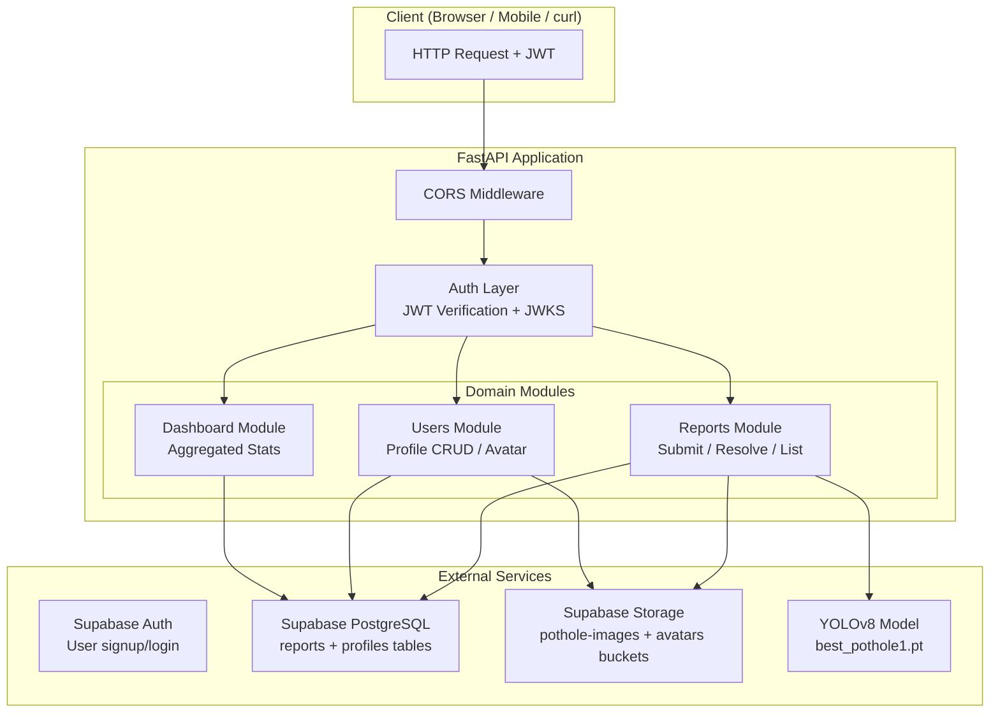
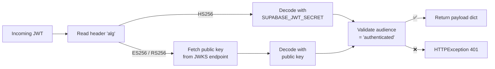
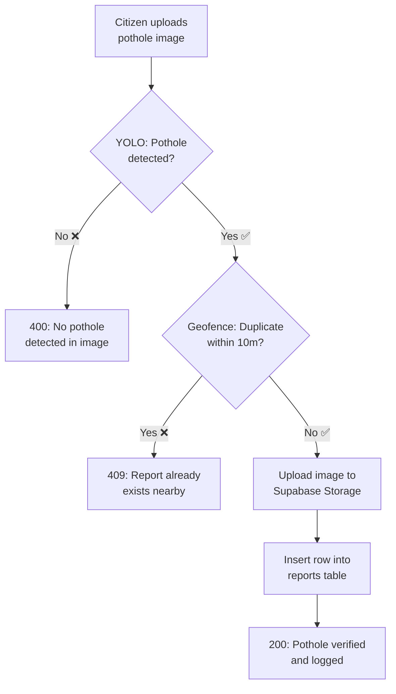
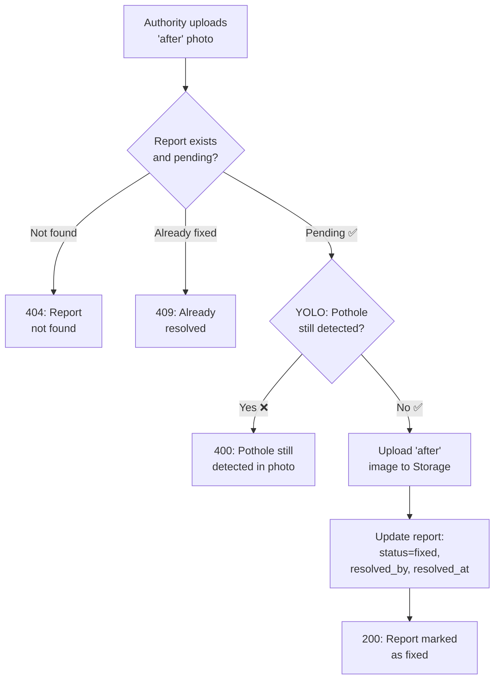
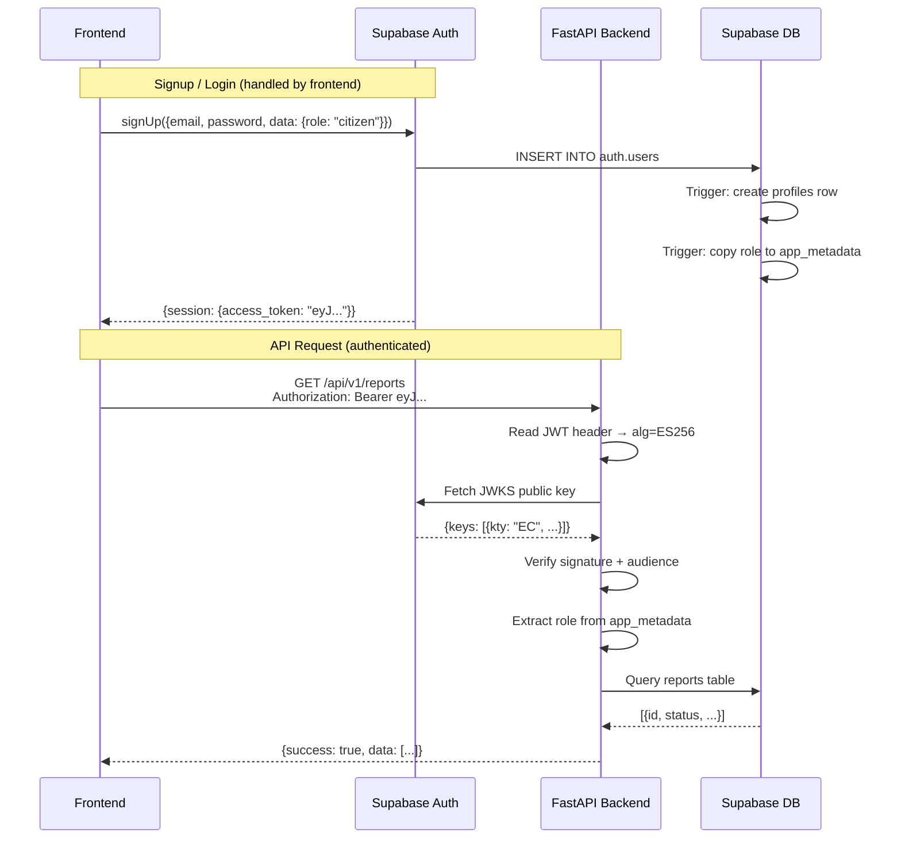

# Pothole Reporter API — Backend Technical Report

## 1. Architecture Overview

The application is a **modular FastAPI backend** for a pothole reporting and resolution platform. It follows a clean separation of concerns with four domain modules:



### Key Design Principles

| Principle | Implementation |
|---|---|
| **Stateless Auth** | Frontend handles signup/login via Supabase SDK; backend only verifies JWTs |
| **Role-Based Access** | `citizen` can report potholes; `authority` can resolve them |
| **AI Gatekeeper** | Both submission and resolution require YOLO verification |
| **Geofencing** | Duplicate reports within 10m radius are rejected |
| **Tamper-proof Roles** | DB trigger copies role into `app_metadata` (cannot be modified by client SDK) |

---

## 2. Directory Structure

```
Backend/
├── main.py                    # Entrypoint (uvicorn launcher)
├── requirements.txt           # Python dependencies
├── .env                       # Environment variables (secrets)
├── .env.example               # Template for .env
├── best_pothole1.pt           # YOLOv8 trained model weights (18.9 MB)
│
├── app/
│   ├── __init__.py            # App factory: create_app()
│   ├── config.py              # Pydantic Settings (env vars)
│   ├── dependencies.py        # Supabase client, YOLO model, image helpers
│   │
│   ├── auth/
│   │   ├── __init__.py
│   │   ├── service.py         # JWT verification (HS256 + ES256 via JWKS)
│   │   └── dependencies.py    # get_current_user, require_citizen, require_authority
│   │
│   ├── users/
│   │   ├── __init__.py
│   │   ├── schemas.py         # ProfileResponse, ProfileUpdate models
│   │   ├── service.py         # Profile CRUD + avatar upload logic
│   │   └── router.py          # /api/v1/users/* endpoints
│   │
│   ├── reports/
│   │   ├── __init__.py
│   │   ├── schemas.py         # ReportResponse model
│   │   ├── service.py         # AI inference, geofence, submit/resolve logic
│   │   └── router.py          # /api/v1/reports/* endpoints
│   │
│   └── dashboard/
│       ├── __init__.py
│       └── router.py          # /api/v1/stats/dashboard endpoint

```


---

## 3. File-by-File Breakdown

### 3.1 Core Application Files

---

#### [main.py] — Entrypoint
| Property | Value |
|---|---|
| Lines | 9 |
| Purpose | Thin uvicorn launcher |

Imports `create_app()` from the app package, creates the `app` instance, and starts the server on `0.0.0.0:8000` with hot-reload enabled.

```python
app = create_app()
if __name__ == "__main__":
    uvicorn.run("main:app", host="0.0.0.0", port=8000, reload=True)
```

---

#### [app/\_\_init\_\_.py] — App Factory
| Property | Value |
|---|---|
| Lines | 34 |
| Purpose | Creates and configures the FastAPI application |

**Function: `create_app() -> FastAPI`**

1. Creates `FastAPI` instance with metadata (title, version, description)
2. Adds `CORSMiddleware` with origins from `settings.CORS_ORIGINS` (default: `["*"]`)
3. Registers 4 routers: Reports, Users, Dashboard, and a default health-check router
4. Health-check endpoint: `GET /` → `{"status": "Pothole Reporter API is running"}`

---

#### [app/config.py] — Configuration
| Property | Value |
|---|---|
| Lines | 31 |
| Purpose | Centralized settings from environment variables |

**Class: `Settings(BaseSettings)`**

| Setting | Type | Default | Source |
|---|---|---|---|
| `SUPABASE_URL` | `str` | `""` | `.env` |
| `SUPABASE_ANON_KEY` | `str` | `""` | `.env` |
| `SUPABASE_JWT_SECRET` | `str` | `""` | `.env` |
| `CORS_ORIGINS` | `List[str]` | `["*"]` | `.env` |
| `GEOFENCE_RADIUS_METERS` | `float` | `10.0` | `.env` |
| `YOLO_MODEL_PATH` | `str` | `"best_pothole1.pt"` | Hardcoded |
| `POTHOLE_IMAGES_BUCKET` | `str` | `"pothole-images"` | Hardcoded |
| `AVATARS_BUCKET` | `str` | `"avatars"` | Hardcoded |

A singleton `settings = Settings()` is instantiated at module load.

---

#### [app/dependencies.py] — Shared Dependencies
| Property | Value |
|---|---|
| Lines | 67 |
| Purpose | Singleton factories for Supabase client, YOLO model, and image helpers |

| Function | Returns | Description |
|---|---|---|
| `get_supabase()` | `supabase.Client` | Lazily creates and caches a Supabase client |
| `get_model()` | `ultralytics.YOLO` | Lazily loads and caches the YOLO model from disk |
| `read_image_bytes(file)` | `bytes` | Reads an `UploadFile` into raw bytes |
| `bytes_to_pil(data)` | `PIL.Image` | Converts raw bytes to a PIL Image object |

> [!NOTE]
> Both `get_supabase()` and `get_model()` use a global variable caching pattern — they are created once on first call and reused for the lifetime of the process.

---

### 3.2 Authentication & Authorization

---

#### [app/auth/service.py] — JWT Verification
| Property | Value |
|---|---|
| Lines | 59 |
| Purpose | Decodes and validates Supabase-issued JWTs |

**How it works:**



| Function | Description |
|---|---|
| `get_jwks_client()` | Returns a cached `PyJWKClient` pointing at `{SUPABASE_URL}/auth/v1/.well-known/jwks.json` |
| `verify_supabase_jwt(token)` | Inspects JWT header `alg`. Uses HS256 local secret or JWKS public key for ES256/RS256. Raises 401 on expiry, invalid audience, or any decode error. |

> [!IMPORTANT]
> Supabase recently switched from HS256 to **ES256** (ECDSA P-256) for signing JWTs. This dual-algorithm support ensures compatibility with both old and new Supabase projects.

---

#### [app/auth/dependencies.py] — Auth Dependencies
| Property | Value |
|---|---|
| Lines | 62 |
| Purpose | FastAPI dependencies for extracting user identity and enforcing roles |

**Dataclass: `UserPayload`**

| Field | Type | Source in JWT |
|---|---|---|
| `user_id` | `str` | `sub` claim |
| `email` | `str` | `email` claim |
| `role` | `str` | `app_metadata.role` (fallback: `user_metadata.role`) |

**Security Scheme**: `HTTPBearer(auto_error=True)` — provides the **Authorize** button in Swagger UI (`/docs`).

**Dependency Functions:**

| Function | Depends On | Behavior |
|---|---|---|
| `get_current_user(credentials)` | `HTTPBearer` | Extracts token → verifies JWT → builds `UserPayload`. Raises 401 (missing user ID) or 403 (unknown role). |
| `require_citizen(user)` | `get_current_user` | Passes if `role == "citizen"`, else 403 |
| `require_authority(user)` | `get_current_user` | Passes if `role == "authority"`, else 403 |

---

### 3.3 Users Module

---

#### [app/users/schemas.py] — Pydantic Models
| Property | Value |
|---|---|
| Lines | 27 |

| Model | Fields | Usage |
|---|---|---|
| `ProfileResponse` | `id`, `email`, `full_name`, `phone`, `avatar_url`, `role`, `created_at`, `updated_at` | API response |
| `ProfileUpdate` | `full_name` (optional), `phone` (optional) | PATCH request body |

---

#### [app/users/service.py] — Profile Business Logic
| Property | Value |
|---|---|
| Lines | 66 |

| Function | Signature | Description |
|---|---|---|
| `get_profile` | `(user_id: str) -> dict` | Queries `profiles` table by `id`. Raises 404 if not found. |
| `update_profile` | `(user_id: str, data: ProfileUpdate) -> dict` | Filters out `None` fields. Raises 400 if nothing to update. Adds `updated_at` timestamp. Returns updated row. |
| `upload_avatar` | `(user_id: str, file: UploadFile) -> str` | Reads file bytes → uploads to `avatars/{user_id}/avatar.{ext}` in Supabase Storage (upsert mode) → constructs public URL → updates `avatar_url` in profiles table → returns URL. |

---

#### [app/users/router.py] — User Endpoints
| Property | Value |
|---|---|
| Lines | 51 |
| Prefix | `/api/v1/users` |
| Tag | `Users` |

| Endpoint | Method | Auth Required | Description |
|---|---|---|---|
| `/api/v1/users/me` | `GET` | Any authenticated user | Retrieve current user's profile |
| `/api/v1/users/me` | `PATCH` | Any authenticated user | Update name and/or phone |
| `/api/v1/users/me/avatar` | `POST` | Any authenticated user | Upload/replace profile picture |
| `/api/v1/users/me/reports` | `GET` | **Citizen only** | List all reports submitted by this citizen |

---

### 3.4 Reports Module

---

#### [app/reports/schemas.py] — Pydantic Models
| Property | Value |
|---|---|
| Lines | 24 |

| Model | Fields |
|---|---|
| `ReportResponse` | `id`, `reported_by`, `latitude`, `longitude`, `status`, `before_image_url`, `after_image_url`, `resolved_by`, `resolved_at`, `created_at` |

---

#### [app/reports/service.py] — Report Business Logic
| Property | Value |
|---|---|
| Lines | 131 |
| Purpose | Core logic: AI inference, geofencing, CRUD |

**Functions:**

| Function | Description |
|---|---|
| `run_inference(image_bytes) -> bool` | Converts bytes to PIL Image → runs YOLO prediction → returns `True` if any detection has confidence ≥ 0.3 |
| `check_geofence(lat, lon) -> bool` | Computes a bounding box (±radius in degrees) → queries DB for pending reports in box → calculates exact Haversine distance → returns `True` if duplicate within radius |
| `submit_report(user_id, lat, lon, image_bytes, filename) -> dict` | Full pipeline: AI verify → geofence check → upload "before" image → insert DB row → return `report_id` |
| `resolve_report(report_id, authority_id, image_bytes, filename) -> dict` | Fetch report → verify pending → AI verify (must NOT detect pothole) → upload "after" image → update status to `"fixed"` with `resolved_by` and `resolved_at` |
| `get_reports(status=None) -> list` | List all reports, optionally filtered, ordered by `created_at` desc |
| `get_report_by_id(report_id) -> dict` | Single report lookup, raises 404 |
| `get_user_reports(user_id) -> list` | All reports by a specific user |

**Submission Flow:**



**Resolution Flow:**



---

#### [app/reports/router.py] — Report Endpoints
| Property | Value |
|---|---|
| Lines | 58 |
| Prefix | `/api/v1/reports` |
| Tag | `Reports` |

| Endpoint | Method | Auth Required | Description |
|---|---|---|---|
| `/api/v1/reports` | `POST` | **Citizen only** | Submit pothole report (multipart form: `latitude`, `longitude`, `image`) |
| `/api/v1/reports` | `GET` | Any authenticated | List all reports (query param: `?status=pending\|fixed`) |
| `/api/v1/reports/{report_id}` | `GET` | Any authenticated | Get single report by UUID |
| `/api/v1/reports/{report_id}/resolve` | `POST` | **Authority only** | Resolve pothole (multipart form: `image`) |

---

### 3.5 Dashboard Module

---

#### [app/dashboard/router.py] — Dashboard Endpoint
| Property | Value |
|---|---|
| Lines | 40 |
| Prefix | `/api/v1/stats` |
| Tag | `Dashboard` |

| Endpoint | Method | Auth Required | Description |
|---|---|---|---|
| `/api/v1/stats/dashboard` | `GET` | Any authenticated | Aggregated statistics |

**Response:**
```json
{
  "success": true,
  "data": {
    "total_reports": 15,
    "pending_repairs": 10,
    "fixed_repairs": 5,
    "repair_rate_percentage": 33.33
  }
}
```

---

## 4. Complete API Reference

| # | Method | Endpoint | Auth | Role | Description |
|---|---|---|---|---|---|
| 1 | `GET` | `/` | None | — | Health check |
| 2 | `GET` | `/api/v1/stats/dashboard` | ✅ | Any | Dashboard metrics |
| 3 | `GET` | `/api/v1/users/me` | ✅ | Any | Get own profile |
| 4 | `PATCH` | `/api/v1/users/me` | ✅ | Any | Update own profile |
| 5 | `POST` | `/api/v1/users/me/avatar` | ✅ | Any | Upload profile picture |
| 6 | `GET` | `/api/v1/users/me/reports` | ✅ | Citizen | List own reports |
| 7 | `POST` | `/api/v1/reports` | ✅ | Citizen | Submit pothole report |
| 8 | `GET` | `/api/v1/reports` | ✅ | Any | List all reports |
| 9 | `GET` | `/api/v1/reports/{report_id}` | ✅ | Any | Get single report |
| 10 | `POST` | `/api/v1/reports/{report_id}/resolve` | ✅ | Authority | Resolve pothole report |

---

## 5. Database Schema

### `reports` table (pre-existing + new columns)

| Column | Type | Constraints | Description |
|---|---|---|---|
| `id` | `UUID` | PK, auto-generated | Report identifier |
| `reported_by` | `UUID` | FK → `auth.users` | Citizen who submitted |
| `latitude` | `FLOAT` | NOT NULL | GPS latitude |
| `longitude` | `FLOAT` | NOT NULL | GPS longitude |
| `status` | `TEXT` | `'pending'` or `'fixed'` | Current state |
| `before_image_url` | `TEXT` | | URL to "before" photo |
| `after_image_url` | `TEXT` | Nullable | URL to "after" photo |
| `resolved_by` | `UUID` | FK → `auth.users`, Nullable | **NEW** — Authority who fixed it |
| `resolved_at` | `TIMESTAMPTZ` | Nullable | **NEW** — When it was fixed |
| `created_at` | `TIMESTAMPTZ` | Default: `now()` | When it was reported |

### `profiles` table (NEW)

| Column | Type | Constraints | Description |
|---|---|---|---|
| `id` | `UUID` | PK, FK → `auth.users` ON DELETE CASCADE | User identifier |
| `email` | `TEXT` | | User email |
| `full_name` | `TEXT` | | Display name |
| `phone` | `TEXT` | Nullable | Phone number |
| `avatar_url` | `TEXT` | Nullable | Profile picture URL |
| `role` | `TEXT` | CHECK: `'citizen'` or `'authority'` | User role |
| `created_at` | `TIMESTAMPTZ` | Default: `now()` | Account creation time |
| `updated_at` | `TIMESTAMPTZ` | Default: `now()` | Last profile update |

### Database Triggers

| Trigger | Fires On | Action |
|---|---|---|
| `on_auth_user_created` | `AFTER INSERT` on `auth.users` | Auto-creates a `profiles` row with `email`, `full_name`, and `role` from signup metadata |
| `on_auth_user_created_set_role` | `AFTER INSERT` on `auth.users` | Copies `role` from `raw_user_meta_data` into `raw_app_meta_data` so it's embedded in the JWT and cannot be tampered with by the client |

### Row Level Security (RLS)

| Policy | Table | Action | Rule |
|---|---|---|---|
| Users can view their own profile | `profiles` | `SELECT` | `auth.uid() = id` |
| Users can update their own profile | `profiles` | `UPDATE` | `auth.uid() = id` |

---

## 6. Supabase Storage Buckets

| Bucket | Visibility | Purpose | File Path Pattern |
|---|---|---|---|
| `pothole-images` | Public | Before and after pothole photos | `{user_id}/{uuid}_{filename}` |
| `avatars` | Public | User profile pictures | `{user_id}/avatar.{ext}` |

---

## 7. Authentication Flow



---


## 10. Technology Stack

| Layer | Technology | Version |
|---|---|---|
| **Runtime** | Python | 3.13 |
| **Web Framework** | FastAPI | ≥ 0.111.0 |
| **ASGI Server** | Uvicorn | ≥ 0.30.0 |
| **Database** | Supabase (PostgreSQL 15) | Cloud |
| **Auth Provider** | Supabase Auth | Cloud |
| **Object Storage** | Supabase Storage | Cloud |
| **AI Model** | YOLOv8 (Ultralytics) | ≥ 8.2.0 |
| **Image Processing** | Pillow | ≥ 10.0.0 |
| **JWT Library** | PyJWT | ≥ 2.8.0 |
| **Settings** | pydantic-settings | ≥ 2.0.0 |
| **Env Loading** | python-dotenv | ≥ 1.0.0 |
| **Supabase Client** | supabase-py | ≥ 2.0.0 |
| **Testing** | pytest + pytest-anyio + httpx | Latest |

---

## 11. Environment Variables

| Variable | Required | Description |
|---|---|---|
| `SUPABASE_URL` | ✅ | Supabase project URL |
| `SUPABASE_ANON_KEY` | ✅ | Supabase anonymous/public API key |
| `SUPABASE_JWT_SECRET` | ✅ | JWT secret for HS256 verification (from Supabase dashboard) |
| `CORS_ORIGINS` | ❌ | Comma-separated allowed origins (default: `*`) |
| `GEOFENCE_RADIUS_METERS` | ❌ | Duplicate detection radius (default: `10`) |

---

## 12. How to Run

```bash
# 1. Activate virtual environment
cd Backend
source miniproject/bin/activate

# 2. Install dependencies (if needed)
pip install -r requirements.txt

# 3. Configure environment
cp .env.example .env
# Edit .env with your Supabase credentials

# 4. Run SQL migration in Supabase Dashboard → SQL Editor
# (paste contents of supabase_setup.sql)

# 5. Create 'avatars' bucket in Supabase Dashboard → Storage

# 6. Start the server
python main.py
# Server runs at http://localhost:8000
# Swagger docs at http://localhost:8000/docs
```
